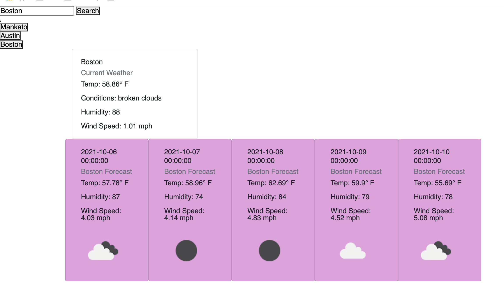

# Homework-6---Weather-App
This project is a weather app that allows the user to search for a city and view the current and forecasted weather for that city. Previous searches are saved in the history below the search bar.

## Functionality
When the page loads, a search bar appears with placeholder text instructing the user to enter a city. The user can click the search bar or hit the Enter key to fetch and present the current weather for that city, and below that the forecast for the next five days.

Once a city is searched, a button with that city appears below in the History section. The user can click any of these previous searches to bring up that city's data. If the user searches the same city twice using the text input, only one button will appear for that city.

## Future Enhancements
The developer would like to show the average of all the forecasted weather for each day, instead of displaying the midnight forecast for each day.

The developer would also like to display the forecast background color in a gradient, depending on the humidity for that day.

The developer would also like to eventually make the page look more professional in general using CSS.

The page can be accessed online [here.](https://mat-lundin.github.io/Homework-6---Weather-App/)

